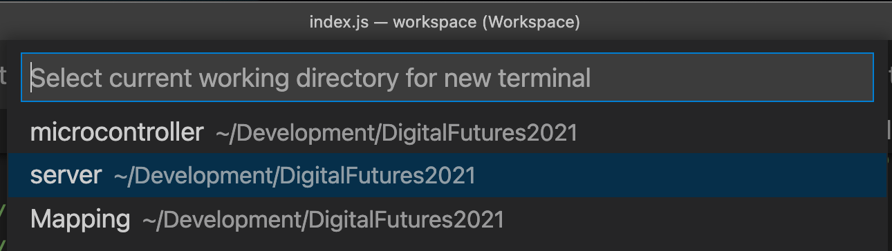
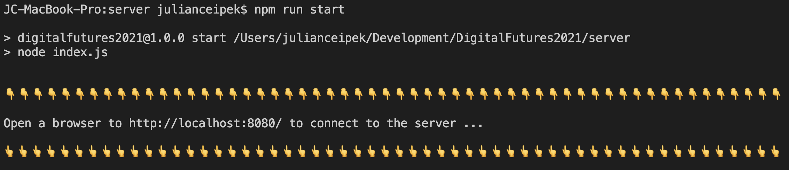
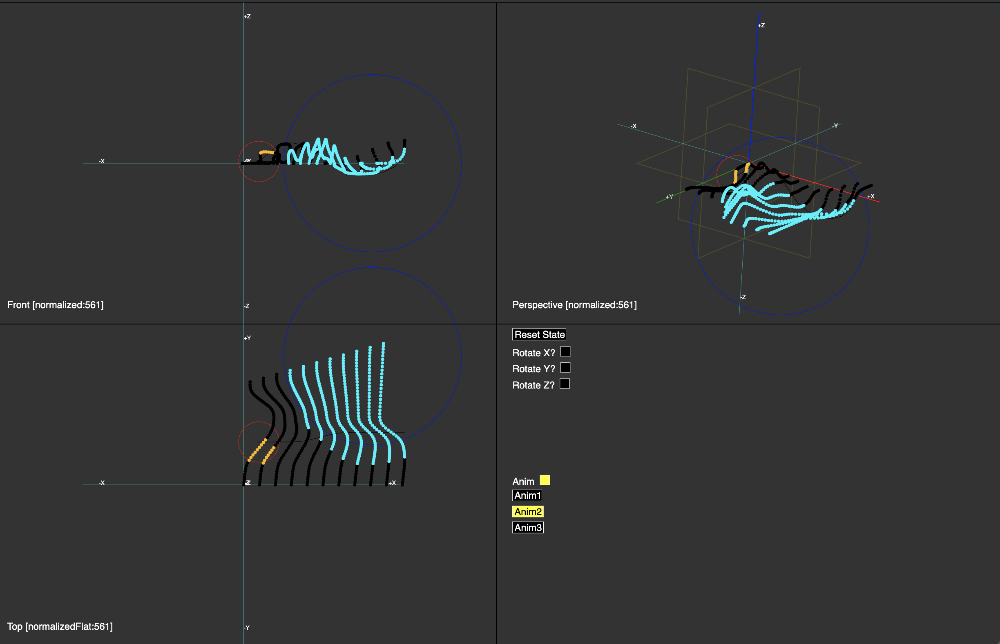
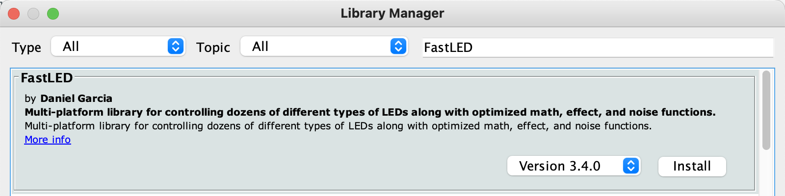
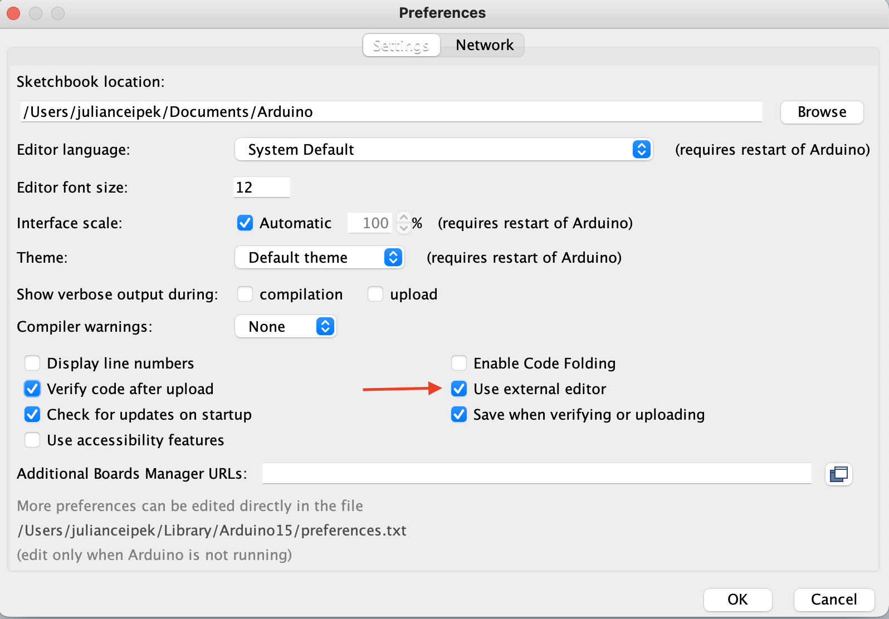
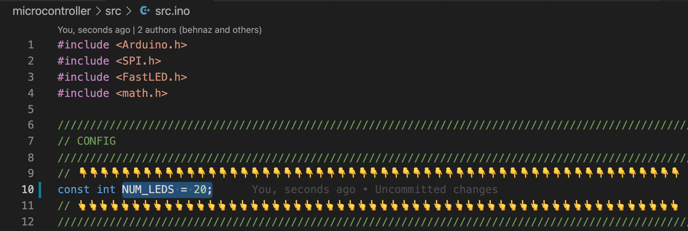
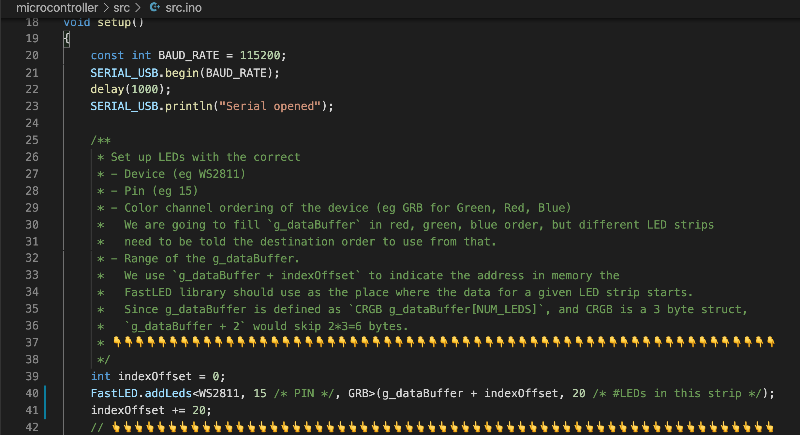
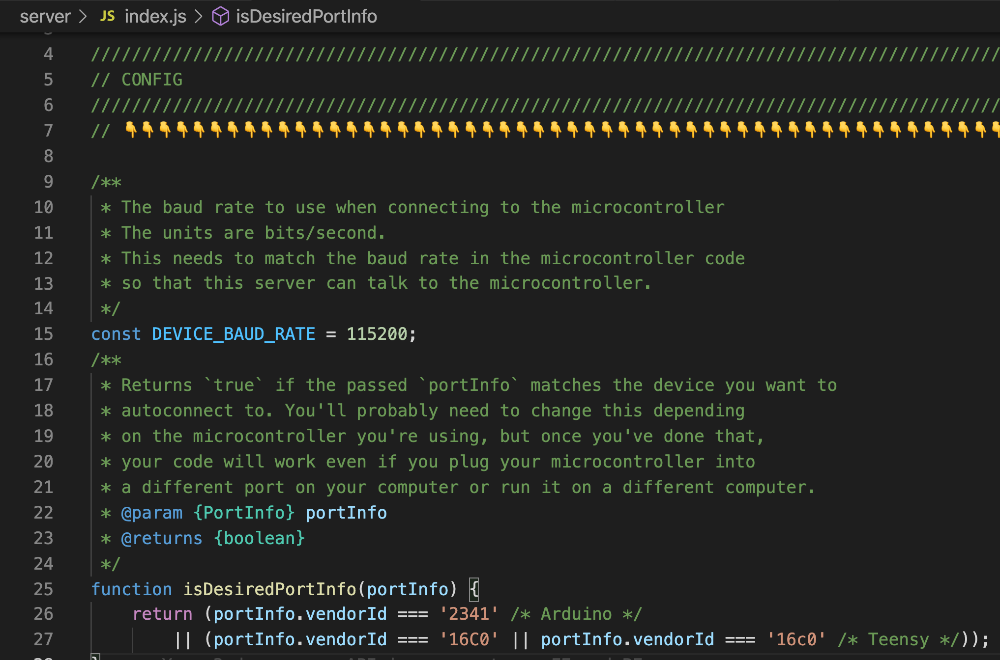

# Guide

[Beyond the Grid: Interactive Installations with Wacky Topologies](https://www.digitalfutures.world/workshops/history/view?workshops=105&cid=32&year=2021)

Drawings and diagrams may be found [here](https://miro.com/app/board/o9J_l9vyjsE=/)

# Workshop Outcomes (Video)
[](https://www.youtube.com/watch?v=EfWlIOijRms])

# Getting Started

1. Make sure you have downloaded and installed the required software:
    - **Visual Studio Code** from [https://code.visualstudio.com/](https://code.visualstudio.com/)
        - We'll use this to write code and to run our creative coding environment for developing animations for installations
    - **NodeJS** (includes `npm`, the node package manager) (you can get it from [https://nodejs.org/en/download/](https://nodejs.org/en/download/))
        - If prompted, make sure to add `npm` to your path
        - We need this in order to run Javascript code that talks to a microcontroller
    - **Rhino** (includes Grasshopper) from [https://www.rhino3d.com/download/](https://www.rhino3d.com/download/)
        - We'll use this to create mappings we can use in creative coding
    - The **Arduino IDE** from [https://www.arduino.cc/en/software](https://www.arduino.cc/en/software)
        - We'll use this to upload code to the microcontroller
    - Any modern web browser. The latest versions of **Google Chrome**, **Microsoft Edge**, **Firefox**, and **Safari** should all work.
        - We'll use this to visualize, tweak, and debug our animations
2. Download the repository from [https://github.com/Julian-Behnaz/DigitalFutures2021/](https://github.com/Julian-Behnaz/DigitalFutures2021/)
3. Open the `workspace.code-workspace` file in Visual Studio Code
    - The first time you do this, VSCode will prompt you whether you trust the workspace. We recommend you click yes, but everything we'll be doing will work even if you "browse folder in restricted mode". This is a new VSCode security feature you can learn about here: [https://code.visualstudio.com/docs/editor/workspace-trust](https://code.visualstudio.com/docs/editor/workspace-trust)
4. Open a new terminal in Visual Studio Code
    - See [https://code.visualstudio.com/docs/editor/integrated-terminal](https://code.visualstudio.com/docs/editor/integrated-terminal) for instructions
    - Select the `server` directory as the working directory for the terminal

        

5. Install the NodeJS dependencies we'll use to talk to the microcontroller by typing this command in the terminal and pressing the "enter" or "return" key:

    ```bash
    npm install
    ```

6. Run the creative coding environment server from the terminal by typing this command and pressing the "enter" or "return" key:

    ```bash
    npm run start
    ```

    This will start a program that acts as a web server and as a conduit to send animations from your computer to your microcontroller.

7. Open the url indicated in the terminal (you might have to scroll up to see it). You can also copy from here: `http://localhost:8080`

    

    This will open our custom installation visualization environment:

    

# Directory Overview

The code we provide comes with several different folders. Here's an overview of the ones you might need to care about:

- `server`
    - `front`
        - `mappings` - a folder containing `.json` files with different LED position mappings. **You'll export files into this folder from Grasshopper and load them in `main.js`.**
        - `index.html` - the HTML file that imports `main.js`. You probably won't want to change it. It provides automatic error detection/recovery and reloads the browser when the server tells it that files have changed.
        - `main.js` - the main javascript file that runs in the browser. **You'll spend most of your time here**, writing animations. Note that the file is very long, but don't worry; you don't need to understand it all. There's a playground section at the bottom where you'll write your code. The rest of it provides a creative coding environment and defines functions you can use.
    - `index.js` - the server code that talks to the web browser and microcontroller. You'll only need to change this **if it can't find your microcontroller** [see here](https://github.com/Julian-Behnaz/DigitalFutures2021/blob/c1bb9afd0c4410749882add711df697addd4b4e1/server/server.js#L16-L28) or if you need to tweak something like the microcontroller baud rate.
- `microcontroller`
    - `src`
        - `src.ino` - **The microcontroller code you need to tweak and upload to your Arduino.**
    - `platformio.ini` - You can upload code to an Arduino directly from within Visual Studio Code using the [PlatformIO extension](https://platformio.org/) instead of the Ardiono IDE. It's fantastic when it works but can be a bit tricky to set up, so **we won't cover it during the workshop**. If you have a working PlatformIO installation and want to use it, modify this file to choose to which microcontroller you want to upload your code.

# Configuring and uploading the Arduino Code

You can run the installation visualizer without connecting a microcontroller, but at some point you'll actually want to try out your animations on real hardware. Every setup is slightly different, so you'll need to tweak a few things.

1. In the Arduino IDE, install the FastLED library:
    1. Open the Library manager (Tools→Manage Libraries)
    2. Search for and install FastLED

        

2. Configure the Arduino IDE to use an external editor so that Visual Studio Code and the Arduino app don't fight over which one is allowed to edit files:

    

3. Open `microcontroller/src/src.ino` in Visual Studio Code
4. Modify `NUM_LEDS` to match the total number of individual LEDs you will be controlling in total. If you have multiple LED strips, add up the number in every strip.

    

5. Modify the `setup` function to have the correct 
    - number of LED strips you have
    - type of LED strips
    - color ordering of each LED strip
    - number of LEDs in each strip

    

6. Upload the code to your Arduino.
    - **IMPORTANT: make sure your server isn't running in any terminal — it will try to communicate with your microcontroller, and you can't upload code to it while something else is trying to communicate with it.**
        - To do this, hit the Control+c keys in the terminal where you ran `npm run start` to stop it (yes, it's the actual `control` key, even on a Mac. Don't use Command+c; it won't work)
    - Open `microcontroller/src/src.ino` in the Arduino IDE
    - Make sure your microcontroller is connected to your computer
    - Select your port and board
    - Compile and upload your code to the microcontroller

# Configuring the Server Code to find your Microcontroller

We've tested the server on Windows and MacOS and it should be able to find official Arduino Uno boards and Teensy 3.1, 3.2, 3.5 boards. When you have the server running with `npm run start` and connect one of these microcontrollers, you should see a message that says `status: 'Connected'` in the terminal. **If this doesn't happen**, you might have a microcontroller with a vendor id we didn't account for. Here's how to fix that problem:

1. Open `server/index.js` in Visual Studio Code.
2. Modify the function `isDesiredPortInfo` to return true if `portInfo` matches the board you want to detect. You can look at the terminal output when the server is running to find the properties of your specific connected devices so that you can use one or more of those values in the `isDesiredPortInfo` function.

    

# Troubleshooting

Sometimes things go wrong. Check these things:

1. Have you configured and uploaded the microcontroller code (while the server **wasn't** running)?
2. Is the server running? (`npm run start` in the `server` directory)
3. Is the microcontroller physically connected to the computer?
4. Has the server found and connected to the microcontroller? (see [this](https://github.com/Julian-Behnaz/DigitalFutures2021/blob/c1bb9afd0c4410749882add711df697addd4b4e1/server/server.js#L16-L28) if it hasn't)
5. Is the browser window open to the correct URL? (note that you have to refresh the browser window if you stop the server and restart it, and only one browser window can talk to the server at a time to avoid conflicts between messages intended for the microcontroller)
6. Does the number of bytes sent from the server match the number of bytes the microcontroller is expecting? (if not, check to make sure that the browser is sending the server 3x the number of bytes as you have LEDs and that the microcontroller code is configured for the correct number of LEDs)
7. (If animations are showing up on the strip(s) but the colors are wrong) Does the channel ordering specified in the microcontroller code match the requirements of your LED strip(s)? See if `RGB`, `RBG`, `GRB`, `GBR`, `BRG`, or `BGR` would be the correct ordering. Also check if you've specified the correct chipset for your LED strip. Consider running a FastLED example program.
